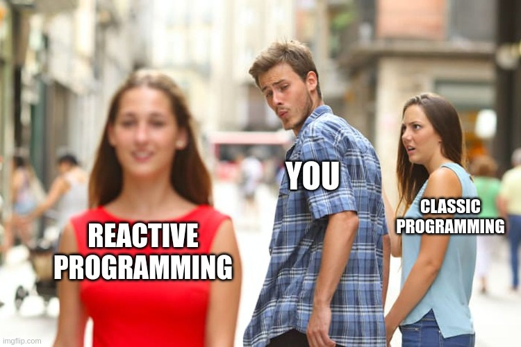
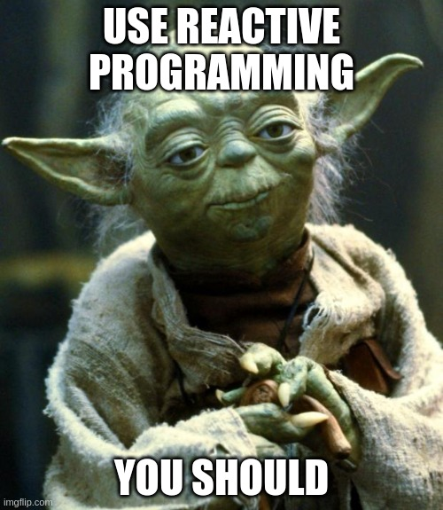

# Why Reactive Programing is so awesome ?

In this post I want to share my personal experience with Reactive Programing and why you should consider using it.

<p align="center">
  
</p>

## Overview 

> **Reactive Programing** is a different way to develop, work with evolving values and manage asynchronous data streams.

Usually, in your applications (especially for front-end developers), you use many values that change over time. ex:

- the current date and time updated every seconds
- a translated text, that changes with the user locale (and maybe some `<select>`)
- the state of a submit button (enabled/disabled), if a form is valid/invalid
- a data stream coming from the backend (ex: live stats)
- etc...

Most of these evolving values are commonly managed by a framework:
usually using a pull mechanism and running some change detection algorithm.

Reactive Programing uses a different approach: **you'll build many streams of values called `Observables`.**
Then, RP libraries will give you an amazing toolbox of functions to combine, create and filter any of those streams.
That's where the "functional" magic kicks in. A stream can be used as an input to another one.
Even multiple streams can be used as inputs to another stream.
You can merge two streams. You can filter a stream to get another one that has only those events you are interested in.
You can map data values from one stream to another new one. Etc.

Actually, you're probably already familiar with async data streams: Promises, EventListeners, setInterval, etc.
Reactive programing is all about this but on steroids.

> You'll be able to create Observables of anything, not just from click and hover events:
variables, user inputs, properties, tasks, data structures,...

<p align="center">
  
</p>


## Reactive Programming by example

The most commonly used RP library in javascript is [RxJS](https://rxjs.dev/), however,
I'll use [rx-js-light](https://github.com/lifaon74/rx-js-light) due to its simplicity, documentation and performances.


```ts
const currentTimestamp$ = map$$(interval(1000), () => Date.now());
```

First, you have to know that, by convention, an Observable ends with `$`, and `rx-js-light` extends this principle
to many functions that generates an Observable which ends with `$$`.

In this example, I've built an Observable that emits the current timestamp every 1000ms.
It is built from another Observable (`interval(1000)`) those values are mapped to the current timestamp (`Date.now()`).

An Observable is not started until you subscribe to it. To do so:

```ts
const unsubscribe = currentTimestamp$((timestamp) => {
  console.log(timestamp);
});
```

Subscribing to an Observable will return an `unsubscribe` function, which, when called,
will notify the Observable to stop sending more values, and free any async resources.

```ts
window.onclick = unsubscribe;
```

If you prefer to receive the date as a string instead of a number, you could write:

```ts
const currentDateString$ = map$$(currentTimestamp$, (t) => new Date(t).toLocaleString());
```

Ok, at this point, everything is pretty simple, but Observables shines when you have to perform many operations on them.

We will try to display the date from a locale selected by the user:

```ts
const DEFAULT_LANGUAGES = [
  'en',
  'fr',
  'de',
  'it',
  'es',
];

function createLocaleSelectElement(
  languages: string[] = DEFAULT_LANGUAGES,
): HTMLSelectElement {
  const selectElement = document.createElement('select');

  const displayNames = new Intl.DisplayNames(navigator.languages, { type: 'language' });

  for (let i = 0, l = languages.length; i < l; i++) {
    const locale: string = languages[i];
    const optionElement = document.createElement('option');
    optionElement.value = locale;
    optionElement.innerText = displayNames.of(locale);
    selectElement.appendChild(optionElement);
  }

  return selectElement;
}
```

This will create a &lt;select&gt; element from a list of predefined languages.

And now we will create an observable from it:


```ts
function createLocaleSelectElementObservable(
  languages?: string[],
): IObservable<string> {
  const selectElement = createLocaleSelectElement(languages);
  document.body.appendChild(selectElement);
  
  return merge([
    reference(() => selectElement.value),
    map$$(fromEventTarget(selectElement, 'change'), () => selectElement.value),
  ]);
}
```

I'll need to develop a little to understand what appends:

- `reference(() => selectElement.value)`: this creates an Observable which emits the &lt;select&gt; element's value (the locale chosen by the user).
- `fromEventTarget(selectElement, 'change')`: creates an Observables which listen for the 'change' event of the &lt;select&gt;,
then it is mapped using the `map$$` function to get the selected locale
- `merge`: subscribes to the list of Observables and re-emits all their values. we use `merge` and `reference`
because the 'change' event is not immediately triggered when we subscribe to our Observable.

Then we can generate and assign this Observable:

```ts
const locale$ = createLocaleSelectElementObservable();
```

And now, we can re-write our `currentDateString$` Observable:

```ts
const currentDateString$ = function$$(
  [currentTimestamp$, locale$],
  (currentTimestamp, locale) => new Date(currentTimestamp).toLocaleString(locale)
);
```

The `function$$` Observable, takes a list of Observables, awaits for their values, and maps then through a function.

At this point, if any of `currentTimestamp$` or `locale$` changes, it will be reflected on `currentDateString$`.

[You can find a demo here](https://stackblitz.com/edit/typescript-eidguw?devtoolsheight=33&file=index.ts)

If all of this code seems a little confusing, it's because Reactive Programming **is a framework**,
so it requires to learn a bunch of functions, and this is where most developers give up.
Hopefully, `rx-js-light` provides a clear documentation with many examples, and when you'll be confortable with RP,
it will be a breeze to develop complex applications and pipelines.

This example is just the tip of the iceberg: you can apply the same operations on different kinds of streams,
for instance, on a stream of API responses; on the other hand, there are plenty of other functions available.


## Why you should consider adopting RP ?

Reactive Programming raises the level of abstraction of your code, so you can focus on the interdependence of events that define the
business logic, rather than having to constantly fiddle with a large amount of implementation details. Code in RP will likely be more
concise.

It manages dynamic values in a different way: instead of using some king of `refresh` function
(to update for example many DOM nodes, if something changes), the variables (Observables) are always fresh and refreshed.
So, no-one have to remember to call `refresh()` on each change, meaning less bugs and less code in your application.

> The benefits are really important in web applications, where you have to deal with a multitude of UI events, async requests, etc...
and react to these changes, like updating the DOM.

Moreover, it handles for you any cancellation: from aborting a fetch, to cancelling an eventListener or a setInterval.
This point, is frequently ignored by developers creating memory-leaks, or very difficult bugs to fix
(like an async tasks that should have been cancelled, but continues to run until it break something - most of the time updating something unwanted).

> Cancelling, any pending tasks (ex: from a destroyed html component) is extremely simple with RP.

## Conclusion

Now you are ready to begin with Reactive Programming, and discover an amazing world of streams, pipes, and dynamic values.

I hope you enjoyed the beauty of this approach, and maybe I converted you to this awesome way of coding.

Create a demo, share it with others, and help to build the web of tomorrow.

<p align="center">
  
</p>

## About rx-js-light

[rx-js-light](https://github.com/lifaon74/rx-js-light) is simply the fastest and smallest javascript library for `Reactive Programming`.
It provides different tools to generate, consume, and pipe Observables and Observers.
This library has been written by myself, to bring RP to more people: 

- I tried to write a better am simpler documentation with many examples
- it is far [faster and smaller](https://github.com/lifaon74/rx-js-light/blob/main/src/documentation/performances.md) than RxJS,
still providing the same functions and tools

Feel free to test this library, share it and give your feedbacks.
