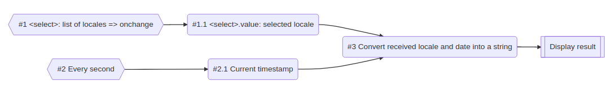
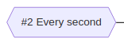

# A practical example for rx-js-light

So, we've seen many things about Observable. Now, it's time to practice.

Let's imagine a simple application where we have a `<select>` that contains a list of languages, and an `<output>` that
display the current date and time formatted according to the selected locale.

Here is the target workflow:



[comment]: <> ()

#### Shared code

First, let's code a function to create our select element:

```ts
const DEFAULT_LANGUAGES = [
  'en',
  'fr',
  'de',
  'it',
  'es',
];

function createLocaleSelectElement(
  languages: string[] = DEFAULT_LANGUAGES,
): HTMLSelectElement {
  const selectElement = document.createElement('select');

  const displayNames = new Intl.DisplayNames(navigator.languages, { type: 'language' });

  for (let i = 0, l = languages.length; i < l; i++) {
    const locale: string = languages[i];
    const optionElement = document.createElement('option');
    optionElement.value = locale;
    optionElement.innerText = displayNames.of(locale);
    selectElement.appendChild(optionElement);
  }

  return selectElement;
}
```

Second, we create and inject our `<select>` and `<output>` elements into the body.

```ts
const selectElement = createLocaleSelectElement();
document.body.appendChild(selectElement);

const outputElement = document.createElement('output');
document.body.appendChild(outputElement);
```

And finally, we create a function that accepts a *locale* and a *date*, and returns the formatted date and time as a
string:

```ts
function formatDate(
  locale: string,
  date: number | Date,
): string {
  return new Intl.DateTimeFormat(locale, {
    year: 'numeric', month: 'short', day: 'numeric',
    hour: 'numeric', minute: 'numeric', second: 'numeric',
  }).format(date);
}
```

Until there, no surprise, it's simple javascript.

#### Classic code

Ok, let's start to implement the expected workflow with a classic approach:

```ts
function classic() {
  let locale: string = selectElement.value;
  let date: number = Date.now();

  const getOutputValue = (): string => {
    return formatDate(locale, date);
  };

  const refresh = () => {
    outputElement.value = getOutputValue();
  };
  
  const onSelectElementChange = () => {
    locale = selectElement.value;
    refresh();
  };

  selectElement.addEventListener('change', onSelectElementChange);
  
  const timer = setInterval(() => {
    date = Date.now();
    refresh();
  }, 1000);

  refresh();

  return () => {
    selectElement.removeEventListener('change', onSelectElementChange);
    clearInterval(timer);
  };
}
```

<details>
  <summary>commented</summary>

```ts
function classic() {
  /* VARIABLES */

  // we create 2 variables that will store the selected locale and the current date
  let locale: string = selectElement.value;
  let date: number = Date.now();

  /* SHARED FUNCTIONS */

  // formats the date and time
  const getOutputValue = (): string => {
    return formatDate(locale, date);
  };

  // updates the <output> element
  const refresh = () => {
    outputElement.value = getOutputValue();
  };

  /* SELECT */

  // when the <select> element changes
  const onSelectElementChange = () => {
    // we update the locale
    locale = selectElement.value;
    // and we refresh the <output>
    refresh();
  };

  // creates an event listener on <select>
  selectElement.addEventListener('change', onSelectElementChange);

  /* DATE */

  // every second
  const timer = setInterval(() => {
    // we update the date
    date = Date.now();
    // and we refresh the <output>
    refresh();
  }, 1000);

  // call refresh to immediately display the current date
  refresh();

  // CLEAN function, to release resources
  return () => {
    selectElement.removeEventListener('change', onSelectElementChange);
    clearInterval(timer);
  };
}
```

</details>

[Click here to see the live demo](https://stackblitz.com/edit/typescript-ttzwzn?file=index.ts)

As you may see it's pretty simple. However, we may quickly anticipate some limits:

- in the real world, we have more than 2 variables, usually in the range of thousands and more,
  so keeping a coherent state (refreshing + updating the variables) is tricky, and bugs will appear soon.
- releasing resources (removeEventListener, clearInterval), can easily be forgotten, creating memory leaks. For
  long-running application this is not optimal.

#### Using observables

Here is the same workflow coded with Observables:

```ts
function observables() {
  return function$$( // #3
    [
      map$$(fromEventTarget(selectElement, 'change'), () => selectElement.value), // #1 -> #1.1
      map$$(interval(1000), () => Date.now()), // #2 -> #2.2
    ],
    formatDate,
  )((value: string) => {
    outputElement.value = value;
  });
}
```

[Click here to see the live demo](https://stackblitz.com/edit/typescript-fdrebf?file=index.ts)

I guess you noticed how compact is it in comparison to the *classic* example.
That's where Reactive Programing shines: asynchronous event streams, and operations on them.

Ok, now let's decompose the code.

---

```ts
const selectElementChange$ = fromEventTarget(selectElement, 'change');
```

This creates an Observable that listen for the `change` Event on the `<select>` element.


---

```ts
const locale$ = map$$(selectElementChange$, () => selectElement.value);
```

This transforms the Event sent by the previous Observable, into the value of the `<select>`. So it's an Observable that
emits the locale selected by the user.


However, because `selectElementChange$` only triggers when a *change* occurs, we will use the previous code in
conjunction with `merge`, to dispatch the current `<select>` value.

```ts
const locale$ = merge([
  single(selectElement.value),
  map$$(selectElementChange$, () => selectElement.value)
]);
```

---

```ts
const timer$ = interval(1000);
```

Creates an Observable that emits every second.




---

```ts
const date$ = map$$(timer$, () => Date.now());
```

Transforms the "ticks" sent by the previous Observable, into the current date expressed as a timestamp. It's an
Observable that emits the current date every second.


---

```ts
const output$ = function$$(
  [locale$, date$],
  formatDate,
);
```

Transforms the locale and the date sent by the previous Observables (`locale$` and `date$`), through `formatDate`. It's
an Observable that emits the current date formatted according to the selected language.


---

```ts
const clean = output$((value: string) => {
  outputElement.value = value;
});
```

The last step is to subscribe to our Observable and display the result. Calling the `clean` function will stop the timer
and remove the event listener automatically


---

When regrouped it gives us:

```ts
function observables() {
  /* SELECT */

  const selectElementChange$ = fromEventTarget(selectElement, 'change'); // #1
  const locale$ = merge([
    single(selectElement.value),
    map$$(selectElementChange$, () => selectElement.value)
  ]); // #1.1

  /* DATE */

  const timer$ = interval(1000); // #2
  const date$ = map$$(timer$, () => Date.now()); // #2.1
  
  // #3
  const output$ = function$$(
    [locale$, date$],
    formatDate,
  );

  return output$((value: string) => {
    outputElement.value = value;
  });
}

const clean = observables();

setTimeout(clean, 5000); // let's say we want to stop our complete workflow in 5s
```

---

So, as you may see, the power of Observables comes from 3 factors:

- they are easy to chain or combine, giving us the possibility to handle long and complex workflow easily, and with
  potentially fewer errors.
- they are PUSH sources, meaning they are extremely useful when a state or a value depends on others:
  if some of them evolves, sub computed values will evolve too.
- subscribing and unsubscribing (releasing all their resources) is especially simple.

So, for any front-end work, they are a good solution to handle the state of your application, update the DOM nodes, and
listen on some events. They work exceptionally well with the DOM.

---

## Table of content

- [Introduction](../01-introduction.md)
- [Installation](../02-installation.md)
- [Your first Observable](../03-your-first-observable.md)
- [Using the built-in Observables](../04-using-the-built-in-observables.md)
- [Emitting values using sources](../05-sources.md)
- [Shortcuts](../06-rx-js-light-shortcuts.md)
- [A practical example for rx-js-light](./07-practical-example.md)
- [Notifications replace RxJS events](../08-notifications.md)

